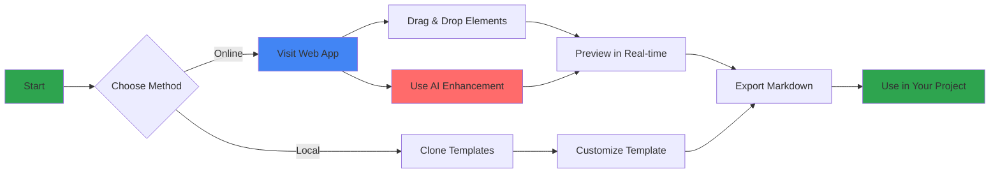
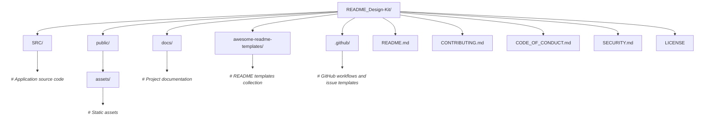

<div align="center">
  <picture>
    <source srcset="./rdk.svg" media="(prefers-color-scheme: dark)">
    <source srcset="./rdkd.svg" media="(prefers-color-scheme: light)">
    
  </picture>

  <h3>✨ Craft Beautiful Documentation in Minutes</h3>
  

  <div align="center">
  
  
    
  
  
</div>
  
</div>


# About
README Design Kit is your all-in-one solution for creating professional, accessible, and visually appealing documentation. This curated collection of templates, components, and AI-powered tools eliminates the guesswork from writing README files, letting you focus on what matters: your code.

Stop staring at blank markdown files. Start shipping documentation that developers actually want to read.


# 🚀 Quick Start

Use a Complete Template
```bash
# Clone the repository
git clone https://github.com/Mayur-Pagote/README_Design_Kit.git

# Navigate to templates
cd README_Design_Kit/templates

# Copy your preferred template
cp web-app-template.md ../your-project/README.md
```
Then: Replace placeholders with your project details and you're done!


# 🔄 How It Works




# 🛠️ Tech Stack

<div align="center">

### Frontend


### UI & Libraries


### AI & APIs


</div>


## 📚 Complete Documentation

<table>
  <tr>
    <td><strong>⚙️ <a href="./docs/setup.md">Setup Guide</a></strong></td>
    <td>Local installation, development environment, and configuration</td>
  </tr>
  <tr>
    <td><strong>🏗️ <a href="./docs/architecture.md">Architecture Overview</a></strong></td>
    <td>Project structure, design decisions, and technical architecture</td>
  </tr>
  <tr>
    <td><strong>🧩 <a href="./READMEelements.md">Component Library</a></strong></td>
    <td>Detailed catalog of all available README elements and examples</td>
  </tr>
  <tr>
    <td><strong>🌟 <a href="./docs/showcase.md">Project Showcase</a></strong></td>
    <td>Real-world examples and featured READMEs built with this kit</td>
  </tr>
  <tr>
    <td><strong>🤝 <a href="./CONTRIBUTING.md">Contributing Guide</a></strong></td>
    <td>How to contribute templates, components, and improvements</td>
  </tr>
  <tr>
    <td><strong>📜 <a href="./CODE_OF_CONDUCT.md">Code of Conduct</a></strong></td>
    <td>Community guidelines and expectations</td>
  </tr>
  <tr>
    <td><strong>🔒 <a href="./SECURITY.md">Security Policy</a></strong></td>
    <td>How to report vulnerabilities responsibly</td>
  </tr>
</table>


## 📁 Project Folder Structure




## How to Contribute:
1. Fork the repository
2. Create a feature branch (`git checkout -b feature/amazing-template`)
3. Make your changes
4. Test your template with a real project
5. Submit a pull request

Read the [Contributing Guidelines](./CONTRIBUTING.md) for detailed instructions.


## 🌟 Open Source Participation
<table>
  <tr>
    <th>Program</th>
    <th>Program Name</th>
    <th>Start Date</th>
    <th>End Date</th>
  </tr>
  <tr>
    <td align="center">
      
    </td>
    <td><strong>Social Summer of Code (SSoC)</strong></td>
    <td>25 June 2025</td>
    <td>25 August 2025</td>
  </tr>
  <tr>
    <td align="center">
      
    </td>
    <td><strong>Social Winter of Code (SWoC)</strong></td>
    <td>1 Jan 2026</td>
    <td>1 March 2026</td>
  </tr>
</table>


## 📄 License

This project is licensed under the **MIT License**. See [LICENSE](./LICENSE) for details.


## 👨‍💻 Maintainer

<div align="center">
  <p>
    <strong>Mayur Pagote</strong><br>
    <a href="https://github.com/Mayur-Pagote">GitHub</a> • 
    <a href="https://www.linkedin.com/in/mayurpagote">LinkedIn</a>
  </p>
</div>


## 🙏 Acknowledgments

Special thanks to:
- All contributors who've shared templates and improvements
- The open-source community for inspiration and feedback


<div align="center">
  <p><strong>Made with ❤️ for developers who care about documentation</strong></p>
  <p><sub>Because great code deserves great documentation</sub></p>
</div>
