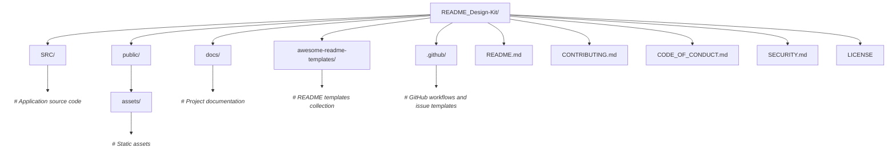

<div align="center">
  <picture>
    <source srcset="./rdk.svg" media="(prefers-color-scheme: dark)">
    <source srcset="./rdkd.svg" media="(prefers-color-scheme: light)">
    
  </picture>

  <h3>✨ Craft Beautiful Documentation in Minutes</h3>
  
  <p>
    <a href="LICENSE">
      
    </a>
    
    
    
  </p>
  
  <p>
    <strong>Transform your project documentation from overlooked to outstanding</strong>
  </p>
</div>

---

## 📘 What is README Design Kit?

**README Design Kit** is your all-in-one solution for creating **professional, accessible, and visually appealing** documentation. This curated collection of templates, components, and AI-powered tools eliminates the guesswork from writing README files, letting you focus on what matters: your code.

Stop staring at blank markdown files. Start shipping documentation that developers actually want to read.

---

## 🎯 Why Choose README Design Kit?

Your README is often the **first—and sometimes only—interaction** someone has with your project. Make it count.

### The Problem
- ❌ Generic, uninspiring documentation that doesn't reflect your project's quality
- ❌ Inconsistent structure across your repositories
- ❌ Hours spent researching what to include
- ❌ Documentation that doesn't speak to your audience

### The Solution
README Design Kit provides:

- ✅ **Battle-tested templates** optimized for different project types
- ✅ **Modular components** you can mix and match instantly
- ✅ **AI-powered enhancement** for professional tone and clarity
- ✅ **Persona preview mode** to see your README through different eyes
- ✅ **Best practices baked in** from hundreds of successful open-source projects

**Result:** Professional documentation in minutes, not hours.

---

## 📦 What's Inside

<table>
  <tr>
    <td align="center">📄</td>
    <td><strong>Ready-to-Use Templates</strong><br/>Pre-built READMEs for web apps, CLI tools, libraries, APIs, and more</td>
  </tr>
  <tr>
    <td align="center">🎨</td>
    <td><strong>Design Components</strong><br/>Badges, banners, tables, shields, and layouts that look polished</td>
  </tr>
  <tr>
    <td align="center">🧱</td>
    <td><strong>Modular Sections</strong><br/>Installation guides, usage examples, contributing guidelines, and more</td>
  </tr>
  <tr>
    <td align="center">🧪</td>
    <td><strong>Real-World Examples</strong><br/>Annotated READMEs from successful projects showing what works</td>
  </tr>
  <tr>
    <td align="center">🤖</td>
    <td><strong>AI Enhancement Tools</strong><br/>Gemini-powered assistance for writing, editing, and refining content</td>
  </tr>
  <tr>
    <td align="center">👥</td>
    <td><strong>Persona Previews</strong><br/>See your README from developer, recruiter, and user perspectives</td>
  </tr>
</table>

---

## 🚀 Quick Start

### Option 1: Use a Complete Template

```bash
# Clone the repository
git clone https://github.com/Mayur-Pagote/README-Design-Kit.git

# Navigate to templates
cd README-Design-Kit/templates

# Copy your preferred template
cp web-app-template.md ../your-project/README.md
```

**Then:** Replace placeholders with your project details and you're done!

### Option 2: Build Your Own

Browse the `components/` directory and assemble sections like:
- Project badges and status indicators
- Installation instructions
- Usage examples with code snippets
- Contributing guidelines
- Licensing and attribution

Mix, match, and customize to fit your exact needs.

---

## 🤖 AI-Powered Documentation

Leverage **Google Gemini AI** to elevate your documentation quality without the effort.

### ✨ What AI Can Do

- **Generate compelling descriptions** that capture your project's essence
- **Refine technical writing** for clarity and professionalism
- **Maintain consistent tone** across all sections
- **Suggest improvements** based on documentation best practices
- **Auto-complete sections** when you provide basic information

### 🔧 Quick Setup

1. **Get an API Key**  
   Visit [Google AI Studio](https://makersuite.google.com/app/apikey) and generate a free Gemini API key

2. **Configure in Settings**  
   Navigate to **Actions → AI Settings** and paste your key

3. **Start Enhancing**  
   Use the ✨ enhancement button in the editor to improve any section

> 💡 **Pro tip:** Start with a rough draft, then let AI polish it to perfection.

---

## 🧠 Persona Preview Mode

Not sure if your README resonates with your audience? Preview it through different lenses:

<table>
  <tr>
    <th>Persona</th>
    <th>What They See</th>
    <th>Focus Areas</th>
  </tr>
  <tr>
    <td>👨‍💻 <strong>Developer</strong></td>
    <td>Technical depth, setup, API docs</td>
    <td>Installation, code examples, architecture, contribution process</td>
  </tr>
  <tr>
    <td>🔍 <strong>Recruiter</strong></td>
    <td>Impact, skills, results</td>
    <td>Project overview, technologies used, your role, achievements</td>
  </tr>
  <tr>
    <td>📦 <strong>Client/User</strong></td>
    <td>Value proposition, ease of use</td>
    <td>Features, benefits, screenshots, getting started quickly</td>
  </tr>
</table>

**Toggle between personas** or view them side-by-side to ensure your README speaks to everyone who matters.

---

## 📚 Complete Documentation

<table>
  <tr>
    <td><strong>⚙️ <a href="./docs/setup.md">Setup Guide</a></strong></td>
    <td>Local installation, development environment, and configuration</td>
  </tr>
  <tr>
    <td><strong>🏗️ <a href="./docs/architecture.md">Architecture Overview</a></strong></td>
    <td>Project structure, design decisions, and technical architecture</td>
  </tr>
  <tr>
    <td><strong>🧩 <a href="./READMEelements.md">Component Library</a></strong></td>
    <td>Detailed catalog of all available README elements and examples</td>
  </tr>
  <tr>
    <td><strong>🌟 <a href="./docs/showcase.md">Project Showcase</a></strong></td>
    <td>Real-world examples and featured READMEs built with this kit</td>
  </tr>
  <tr>
    <td><strong>🤝 <a href="./CONTRIBUTING.md">Contributing Guide</a></strong></td>
    <td>How to contribute templates, components, and improvements</td>
  </tr>
  <tr>
    <td><strong>📜 <a href="./CODE_OF_CONDUCT.md">Code of Conduct</a></strong></td>
    <td>Community guidelines and expectations</td>
  </tr>
  <tr>
    <td><strong>🔒 <a href="./SECURITY.md">Security Policy</a></strong></td>
    <td>How to report vulnerabilities responsibly</td>
  </tr>
</table>

---

## 📁 Project Folder Structure



---

## 🤝 Contributing

We love contributions! Whether you're a documentation expert or writing your first README, there's a place for you here.

### 🌱 Good First Contributions

- **Improve existing templates** with clearer examples
- **Add templates** for new frameworks or project types
- **Enhance documentation** clarity and accessibility
- **Submit showcase examples** of READMEs you've created
- **Fix typos** and improve grammar
- **Suggest new components** or sections

### 📝 How to Contribute

1. Fork the repository
2. Create a feature branch (`git checkout -b feature/amazing-template`)
3. Make your changes
4. Test your template with a real project
5. Submit a pull request

Read the **[Contributing Guidelines](./CONTRIBUTING.md)** for detailed instructions.

---

## 🌟 Show Your Support

If README Design Kit helped you create better documentation:

- ⭐ **Star this repository** to help others discover it
- 💬 **Tell your team** about it
- 🤝 **Contribute** templates or improvements

---

## 📊 Project Stats

<div align="center">
  
  
  
  
</div>

---

## 📄 License

This project is licensed under the **MIT License**. See [LICENSE](./LICENSE) for details.

---

## 👨‍💻 Maintainer

<div align="center">
  <p>
    <strong>Mayur Pagote</strong><br>
    <a href="https://github.com/Mayur-Pagote">GitHub</a> • 
    <a href="https://www.linkedin.com/in/mayurpagote">LinkedIn</a>
  </p>
</div>

---

## 🙏 Acknowledgments

Special thanks to:
- All contributors who've shared templates and improvements
- The open-source community for inspiration and feedback

---

<div align="center">
  <p>
    <strong>Made with ❤️ for developers who care about documentation</strong>
  </p>
  <p>
    <sub>Because great code deserves great documentation</sub>
  </p>
</div>
